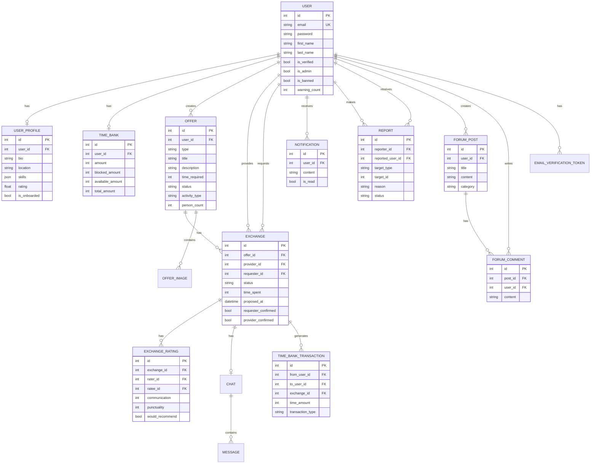

# The Hive - UML Diagrams

Bu dokümanda The Hive sisteminin tüm UML diyagramları Mermaid.js formatında sunulmaktadır.

## Table of Contents

1. [Class Diagram](#1-class-diagram)
2. [Entity Relationship Diagram](#2-entity-relationship-diagram)
3. [Use Case Diagram](#3-use-case-diagram)
4. [State Diagrams](#4-state-diagrams)
5. [Sequence Diagrams](#5-sequence-diagrams)
6. [Activity Diagrams](#6-activity-diagrams)

---

## 1. Class Diagram

### 1.1 Core Domain Models

### 1.2 Communication & Notification Models

### 1.3 Moderation & Forum Models

---

## 2. Entity Relationship Diagram

---

## 3. Use Case Diagram

### 3.1 User Use Cases

### 3.2 Exchange Use Cases

### 3.3 Admin Use Cases

---

## 4. State Diagrams

### 4.1 Exchange State Diagram

### 4.2 Offer/Want State Diagram

### 4.3 Report State Diagram

### 4.4 User Account State Diagram

---

## 5. Sequence Diagrams

### 5.1 User Registration Flow

### 5.2 Complete Exchange Flow (1-to-1)

### 5.3 Want Exchange Flow

### 5.4 Report and Admin Resolution Flow

### 5.5 Group Offer Exchange Flow

---

## 6. Activity Diagrams

### 6.1 User Onboarding Activity

### 6.2 Exchange Completion Activity

### 6.3 Credit Flow Activity

### 6.4 Admin Report Handling Activity

---

## Diagram Usage Notes

### Mermaid.js Rendering

### Diagram Types Summary

| Diagram Type | Purpose |
|--------------|---------|
| **Class Diagram** | Data model structure and relationships |
| **ER Diagram** | Database entity relationships |
| **Use Case Diagram** | Actor interactions with system |
| **State Diagram** | Object lifecycle states |
| **Sequence Diagram** | Interaction flow between components |
| **Activity Diagram** | Process workflow steps |

---

**Document Version:** 1.0  
**Last Updated:** December 2024
